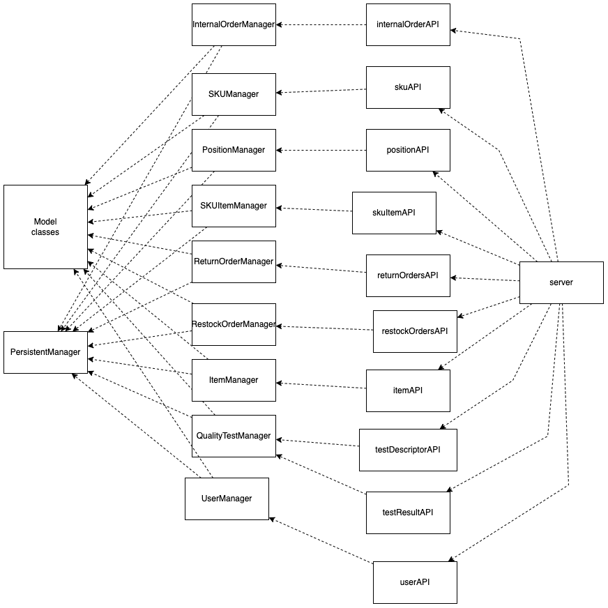

# Integration and API Test Report

Date:

Version:

# Contents

- [Dependency graph](#dependency graph)

- [Integration approach](#integration)

- [Tests](#tests)

- [Scenarios](#scenarios)

- [Coverage of scenarios and FR](#scenario-coverage)
- [Coverage of non-functional requirements](#nfr-coverage)

# Dependency graph 

In the dependency graph we grouped the model classes in one block to avoid confusion.

     
# Integration approach

    <Write here the integration sequence you adopted, in general terms (top down, bottom up, mixed) and as sequence
    (ex: step1: class A, step 2: class A+B, step 3: class A+B+C, etc)> 
    <Some steps may  correspond to unit testing (ex step1 in ex above), presented in other document UnitTestReport.md>
    <One step will  correspond to API testing>

    The sequence we followed to test is bottom up. In fact we firstly tested the PersistentManager methods as unit tests.
    Then we tested the Manager classes using the already tested PersistentManager methods.
    Then we procedeed to test the APIs.
    For the API testing we tested every scenario in the official requirements.
    

#  Integration Tests

   <define below a table for each integration step. For each integration step report the group of classes under test, and the names of
     Jest test cases applied to them, and the mock ups used, if any> Jest test cases should be here code/server/unit_test

## Step 1
| Classes  | mock up used |Jest test cases |
|--|--|--|

|PersistentManager| | PersistentManager.module.test.js |

## Step 2
| Classes  | mock up used |Jest test cases |
|--|--|--|
| SKUManager | | SKUManager.module.test.js|
| SKUItemManager | | SKUItemManager.module.test.js |
| PositionManager || PositionManager.module.test.js|
| UserManager || UserManager.module.test.js|
| RestockOrderManager | | RestockOrderManager.module.test.js |
| ReturnOrderManager |  |ReturnOrderManager.module.test.js| 
| InternalOrderManager | | InternalOrderManager.module.test.js |
| ItemManager | | ItemManager.module.test.js | 
| QualityTestManager | | QualityTestManager.module.test.js |

## Step 3
| API mocha tests| 
| --- |
| testUC1.js |
| testUC2.js |
| testUC3.js |
| testUC4.js |
| testUC5.js |
| testUC6.js |
| testUC7.js |
| testUC9.js |
| testUC10.js |
| testUC11.js |
| testUC12.js |

# API testing - Scenarios

# Coverage of Scenarios and FR

<Report in the following table the coverage of  scenarios (from official requirements and from above) vs FR. 
Report also for each of the scenarios the (one or more) API Mocha tests that cover it. >  Mocha test cases should be here code/server/test

| Scenario ID | Functional Requirements covered | Mocha  Test(s) | 
| ----------- | ------------------------------- | ----------- | 
| 1-1         | FR2                             |  adding a new SKU     |             
| 1-2         | FR2                             |   modifying sku position          |             
| 1-3         |  FR2                               |    modifying sku weight and volume        |             
| 2-1         |    FR3                             |    adding a new Position         |             
| 2-2         |    FR3                             |      modifying a Position ID      |             
| 2-3         |     FR3                            |        modifying weight and volume    |           
| 2-4         |    FR3                             |      modifying aisle,row,col      |  
| 2-5         |    FR3                             |          delete position   |    
| 3-1         |     FR5                            |        addingRO1     | 
| 3-2         |   FR5                              |       addingRO2      | 
| 4-1         |   FR1                              |       adding a new user      | 
| 4-2         |     FR1                            |      modifying a user       | 
| 4-3         |   FR1                              |      deleting user      | 
| 5-1-1        |        FR5                         | updating Delivered state / updating Delivered state invalid | 
| 5-2-1        |           FR5                     | updating Delivered state to tested / updating Delivered state to tested invalid |
| 5-2-1        |           FR5                      | updating Delivered state to tested / updating Delivered state to tested invalid |
| 5-2-2        |            FR5                   | updating Delivered state to tested / updating Delivered state to tested invalid |
| 5-2-3        |            FR5                     | updating Delivered state to tested / updating Delivered state to tested invalid |
| 5-3-1         |   FR5                              |      stock skuItems      | 
| 5-3-2 | FR5 |  stock skuItems |
| 5-3-3 | FR5 | stock skuItems |
| 6-1        |   FR5                              |      new Return Order      | 
| 6-2       |   FR5                              |      new Return Order      | 
| 7-1       |   FR1                              |      test manager Login      | 
| 7-2      |   FR1                              |      test manager Logout      | 
| 9-1     |   FR6                              |      modifyIOState    | 
| 9-2     |   FR6                              |      modifyIOState    | 
| 9-3     |   FR6                              |      modifyIOState    | 
| 10-1     |   FR5.12                              |      modifyState    | 
| 11-1 | FR7 | adding a new Item |
| 11-2 |  FR7 | modifying Item by Id |
| 12-1 | FR3 | adding a new Test Descriptor|
| 12-2 | FR3 | modifying Test Descriptor by Id |
| 12-3 |FR3  | delete Test Descriptor |
 

# Coverage of Non Functional Requirements

<Report in the following table the coverage of the Non Functional Requirements of the application - only those that can be tested with automated testing frameworks.>

### 

| Non Functional Requirement | Test name |
| -------------------------- | --------- |
|             NFR2               |     All      |
| NFR3 | adding a new user |
| NFR4 | adding a new position|
| NFR5 | adding a new SKU |
|  NFR6  |  stock skuItems  | 
| NFR9 |  addingRO1 | 

