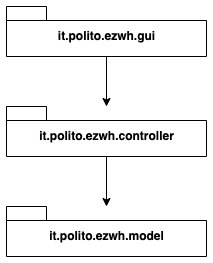
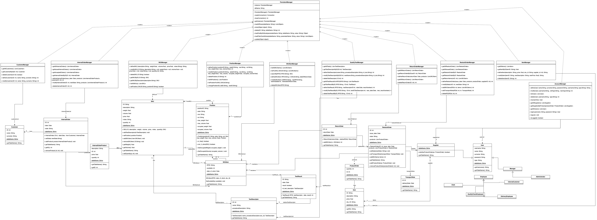
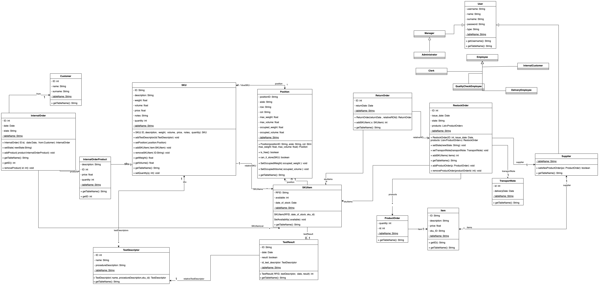
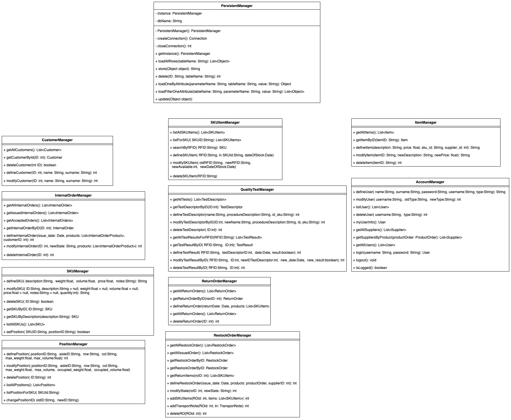
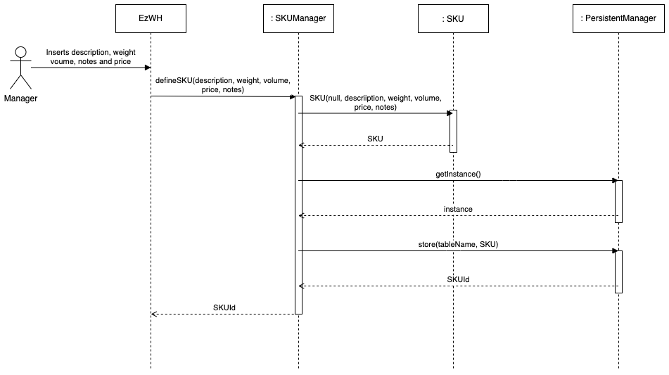
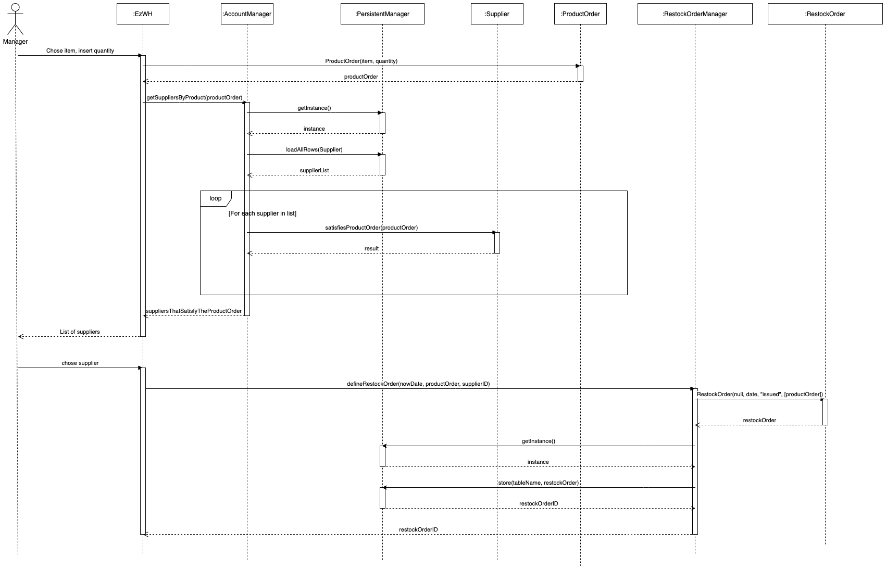
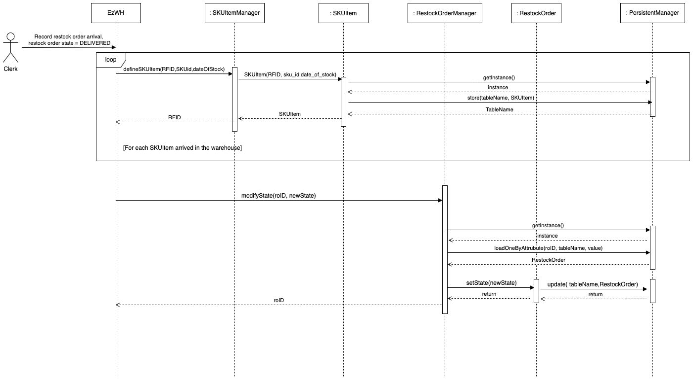
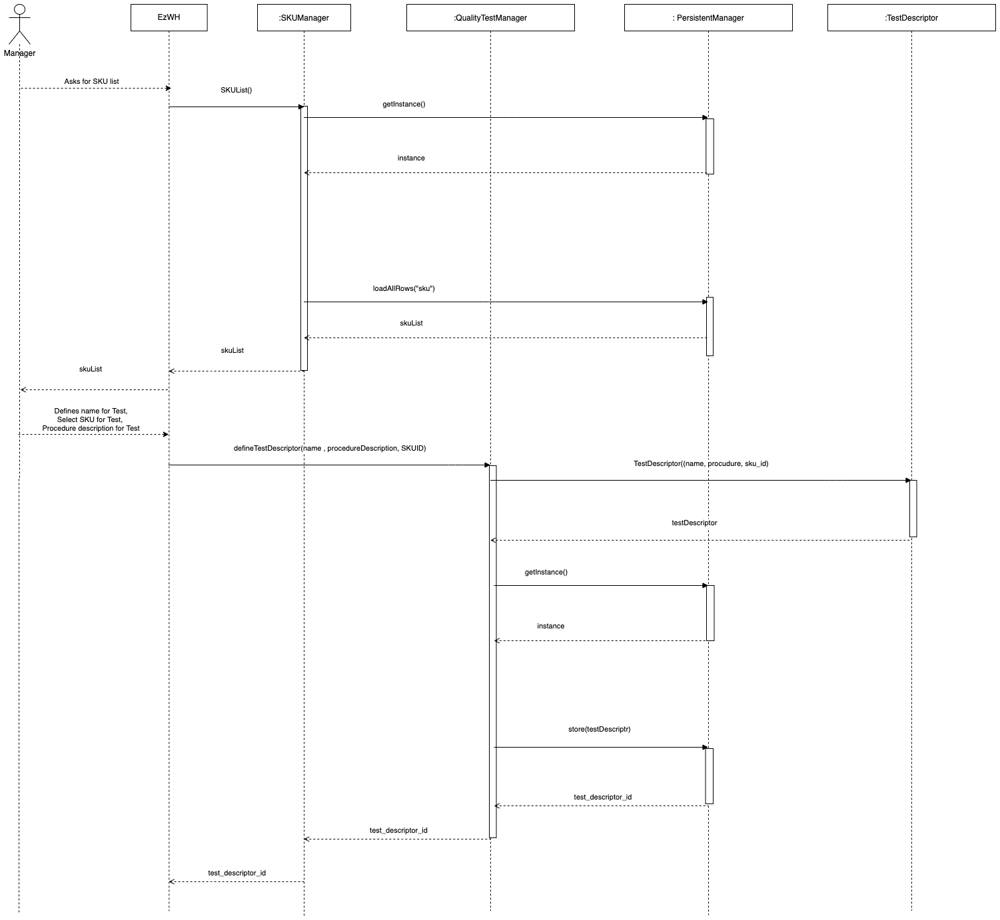

# Design Document 

Authors: Lorenzo D'Amico, Davide Fogliato, Jiaqi Wu, George Florin Eftime

Date: 27/04/2022

Version: 1.0

# Contents

- [High level design](#package-diagram)
- [Low level design](#class-diagram)
- [Verification traceability matrix](#verification-traceability-matrix)
- [Verification sequence diagrams](#verification-sequence-diagrams)

# Instructions

The design must satisfy the Official Requirements document, notably functional and non functional requirements, and be consistent with the APIs

# High level design 

EzWarehouse is a single threaded layered application. It uses the MVC architectural pattern because we have a view that changes based on the data we have.
We have a 3 tier architecture since we have the View, The application logic and a database.
The choice was also made to obtain a lower cohesion and to increase mantainability.
Since the frontend (View) is given we built the backend architecure with:
- Controller: Connects with the entities to manage them and their data. Has function to connect with the database too
- Entity: Incapsulates all the domain classes of our applicationm

# Low level design

From top to bottom in the diagram we have:
- Controller layer (The classes marked as *Manager* plus the PersistencyManager)
- Model layer (The classes under the Controller layer)

Each layer can be seen in the class diagram. Each model class has an attribute called *tablename* that is used by the PersistentManager to modify the correct table in the database. A generic class to manage the database with generic methods was used to keep the connections simplier. The persistentManager uses the ***Singleton creational pattern*** because we only need one instance of the PersistentManager at the time.

The Controller classes are marked as *Manager* and they communicate with the entities to manage their data and call the persistent manager to load/store/delete/modify them to fulfill the requests that come from the frontend.

To better visualize the diagram we split it in 2 parts

## Full class diagram

## Model classes

## Controller classes

# Verification traceability matrix

|            |    PersistentManager | InternalOrderManager |CustomerManager| Customer | InternalOrder | InternalOrderProduct | SKUManager | SKU | PositionManager | Position | SKUItemManager | SKUItem | QualityTestManager | TestDescriptor | TestResult | ReturnOrderManager | ReturnOrder | RestockOrderManager | RestockOrder | ProductOrder | ItemManager | Item | TransportNote | AccountManager | Supplier | User |
|------------|:----------------------:|:----------------------:|:--------------:|:----------:|:---------------:|:----------------------:|:------------:|:-----:|:-----------------:|:----------:|:----------------:|:---------:|:--------------------:|:----------------:|:------------:|:--------------------:|:-------------:|:---------------------:|:--------------:|:--------------:|:-------------:|:------:|:---------------:|:----------------:|:----------:|:------:|
|     FR1    |          X           |                      |                |         |               |                      |            |     |                 |          |                |            |                    |                |            |                    |             |                     |              |              |             |      |               |       X        |    X     |  X   |
|     FR2    |          X           |                      |                |         |               |                      |     X      |  X  |                 |     X    |                |            |                    |                |            |                    |             |                     |              |              |             |      |               |                |          |      |
|     FR3    |          X           |                      |                |         |               |                      |            |     |           X     |     X    |                |     X      |            X       |       X        |        X   |                    |             |                     |              |              |             |      |               |                |          |      |
|     FR4    |          X           |          x           | X              |   X     |               |                      |            |     |                 |          |                |            |                    |                |            |                    |             |                     |              |              |             |      |               |            X   |          |   X  |
|     FR5    |          X           |                      |                |         |               |                      |     X      |     |                 |          |       X        |     X      |          X         |        X       |     X      |            X       |  X          |    X                |       X      |       X      |      X      |   X  |      X        |                |     X    |      |
|     FR6    |          X           |    X                 |       X        |   X     |       X       |          X           |     X      |   X |                 |          |       X        |     X      |                    |                |            |                    |             |                     |              |              |             |      |               |                |          |      |
|     FR7    |          X           |                      |                |         |               |                      |            |     |                 |          |                |            |                    |                |            |                    |             |                     |     

# Verification sequence diagrams 
## Scenario 1-1

## Scenario 3-1

## Scenario 5-1-1

## Scenario 12-1

