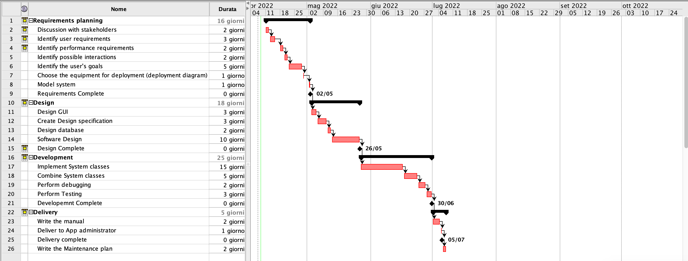

# Project Estimation  
Date: 04/11/2022

Version: 1

# Estimation approach

# Estimate by size
### 
|             | Estimate                        |             
| ----------- | ------------------------------- |  
| NC =  Estimated number of classes to be developed   |  30                           |             
|  A = Estimated average size per class, in LOC       |             400               | 
| S = Estimated size of project, in LOC (= NC * A) | 12000 |
| E = Estimated effort, in person hours (here use productivity 10 LOC per person hour)  |             1200                   |   
| C = Estimated cost, in euro (here use 1 person hour cost = 30 euro) | 36000 | 
| Estimated calendar time, in calendar weeks (Assume team of 4 people, 8 hours per day, 5 days per week ) |       8 weeks        |               

# Estimate by product decomposition
### 
|         component name    | Estimated effort (person hours)   |             
| ----------- | ------------------------------- | 
|requirement document  | 60 |
| GUI prototype | 32  |
|design document | 40  |
|code | 400 |
| unit tests | 300 |
| api tests | 200 |
| management documents  | 80 |

# Estimate by activity decomposition
### 
Jiaqi, [9 apr 2022, 14:33:11]:
|         Activity name    | Estimated effort (person hours)   |             
| ----------- | ------------------------------- | 
| Discussion with stakeholders|32 |
| Identify user requirements|90 |
| Identify performance requirements|32 |
| Identify possible interactions|32 |
| Identify the user's goals|240 |
|Choose the equipment for deployment (deployment diagram)|8 |
| Model system|8 |
|Design GUI|96 |
| Create Design specification|96|
| Design database|64 |
| Software Design|100 |
| Implement System classes|400 |
| Combine System classes|80 |
| Perform debugging|16 |
|Perform Testing|48 |
|Write the manual|16 |
| Deliver to App administrator|8 |
| Write the Maintenance plan|16 |

###

# Summary

Report here the results of the three estimation approaches. The  estimates may differ. Discuss here the possible reasons for the difference

|             | Estimated effort                        |   Estimated duration |          
| ----------- | ------------------------------- | ---------------|
| estimate by size | 1200 | 8 weeks | 
| estimate by product decomposition | 1112 | 7 weeks |
| estimate by activity decomposition | 1382 | 8 weeks |

