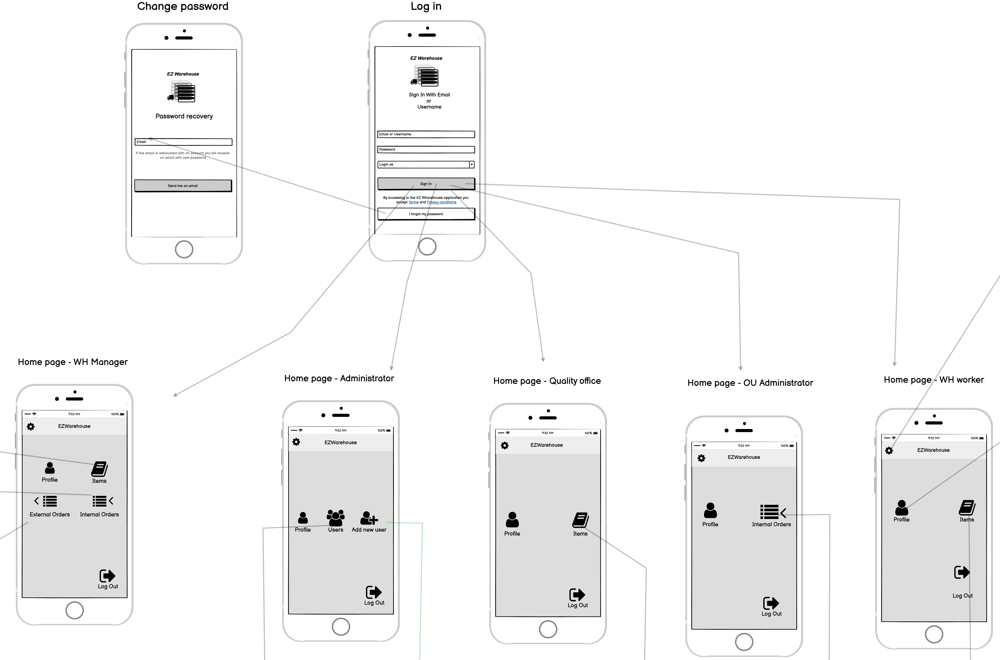

# Graphical User Interface Prototype  

Authors: Davide Fogliato, George Florin Eftime, Jiaqi Wu, Lorenzo D'Amico

Date: 09/04/2022

Version: 1.0

## Complete GUI
This is the complete GUI. To follow the details of the gui.

### Detail 1 - Login, forgot password and home GUI
Here the login page and the different home pages are shown.

### Detail 2 - WH worker GUI
This is all the GUI for the WH Worker.
Here also the settings page is shown which is the same for all users

### Detail 3 - OU administration GUI
This is the OU administrator GUI

### Detail 4 - Administration GUI
This is the App administrator GUI

### Detail 5 - WH manager GUI
This is the WH manager GUI relative to the external and internal order management.

### Detail 6 - WH manager GUI 
This is the WH manager GUI relative to the item management

### Detail 7 - Error page
For the errors we show a pop-up with the error message. Since it's the same for every error we show it separetely
