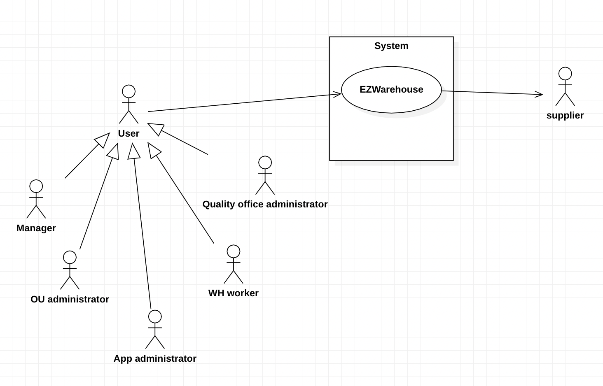
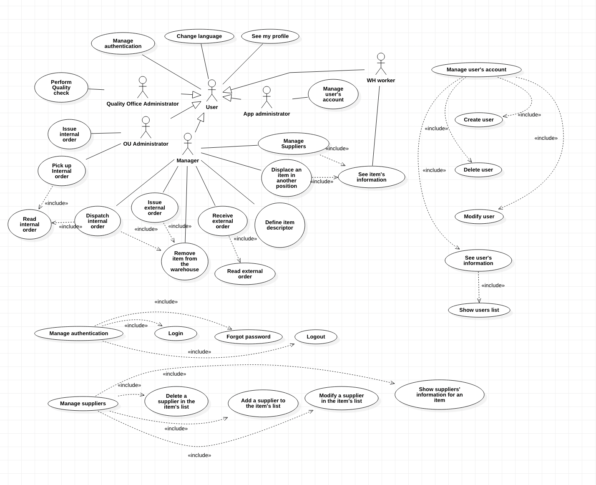
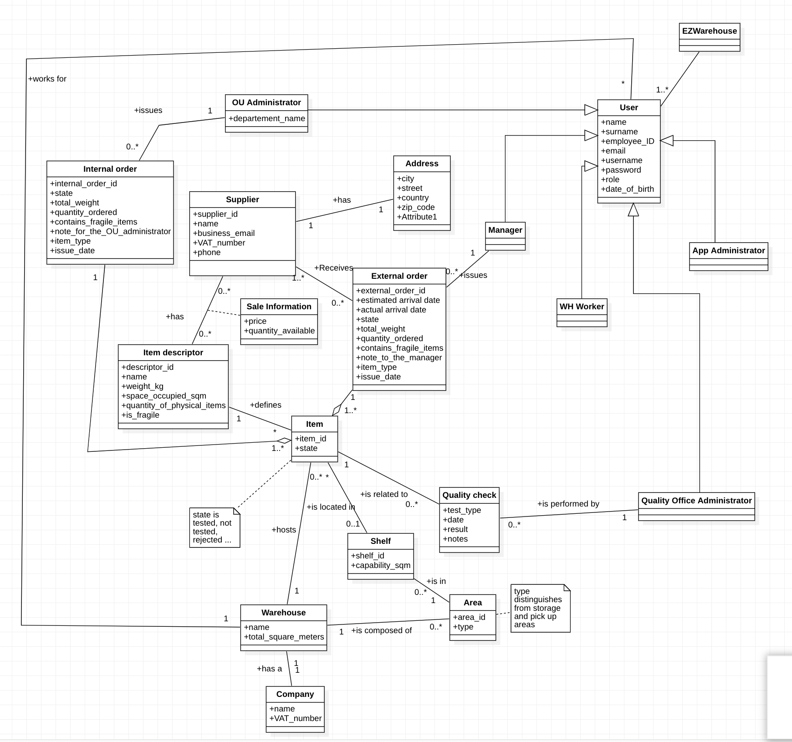
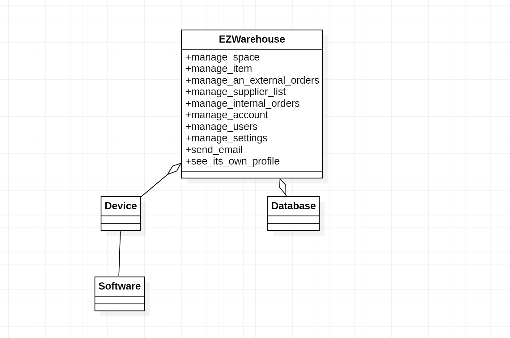
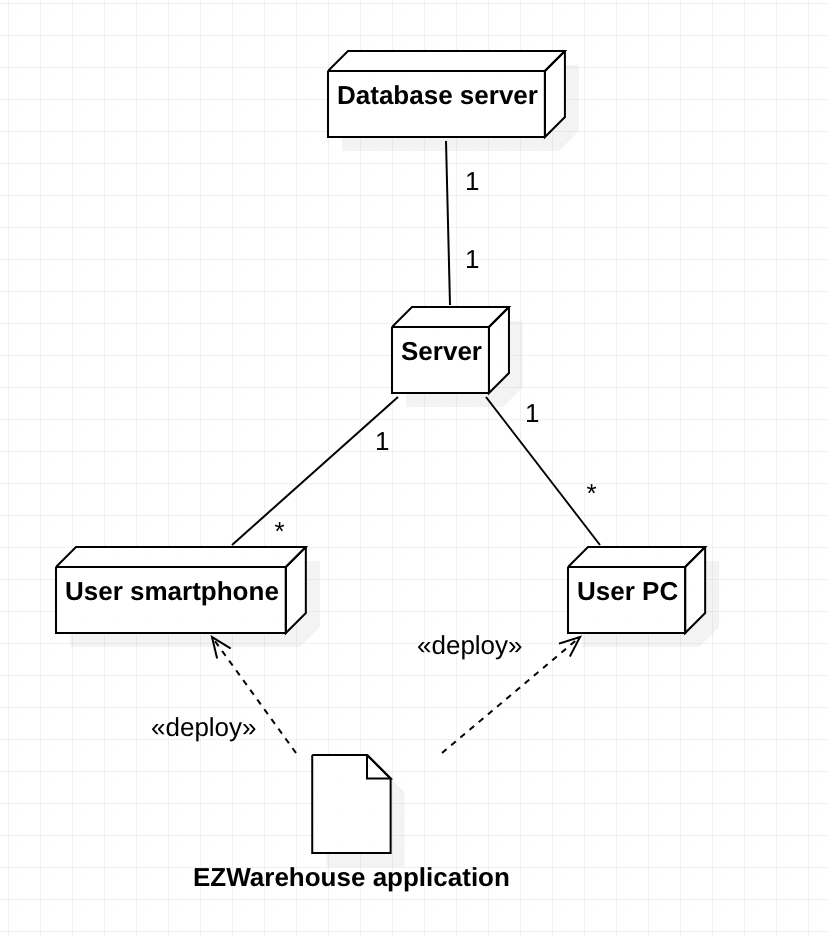

# Requirements Document 

Date: 22 march 2022

Version: 1.0

 
| Version number | Change |
| ----------------- |:-----------|
| | | 

# Contents

- [Informal description](#informal-description)
- [Stakeholders](#stakeholders)
- [Context Diagram and interfaces](#context-diagram-and-interfaces)
	+ [Context Diagram](#context-diagram)
	+ [Interfaces](#interfaces) 
	
- [Stories and personas](#stories-and-personas)
- [Functional and non functional requirements](#functional-and-non-functional-requirements)
	+ [Functional Requirements](#functional-requirements)
	+ [Non functional requirements](#non-functional-requirements)
- [Use case diagram and use cases](#use-case-diagram-and-use-cases)
	+ [Use case diagram](#use-case-diagram)
	+ [Use cases](#use-cases)
    	+ [Relevant scenarios](#relevant-scenarios)
- [Glossary](#glossary)
- [System design](#system-design)
- [Deployment diagram](#deployment-diagram)

# Informal description
Medium companies and retailers need a simple application to manage the relationship with suppliers and the inventory of physical items stocked in a physical warehouse. 
The warehouse is supervised by a manager, who supervises the availability of items. When a certain item is in short supply, the manager issues an order to a supplier. In general the same item can be purchased by many suppliers. The warehouse keeps a list of possible suppliers per item. 

After some time the items ordered to a supplier are received. The items must be quality checked and stored in specific positions in the warehouse. The quality check is performed by specific roles (quality office), who apply specific tests for item (different items are tested differently). Possibly the tests are not made at all, or made randomly on some of the items received. If an item does not pass a quality test it may be rejected and sent back to the supplier. 

Storage of items in the warehouse must take into account the availability of physical space in the warehouse. Further the position of items must be traced to guide later recollection of them.

The warehouse is part of a company. Other organizational units (OU) of the company may ask for items in the warehouse. This is implemented via internal orders, received by the warehouse. Upon reception of an internal order the warehouse must collect the requested item(s), prepare them and deliver them to a pick up area. When the item is collected by the other OU the internal order is completed. 

EZWH (EaSy WareHouse) is a software application to support the management of a warehouse.

# Stakeholders

| Stakeholder name  | Description | 
| ----------------- |:-----------:|
|   Warehouse manager  | Supervises the availability of items, issues an order when a certain item is in short supply and organizes the storage updating the app inventory of the products stocked in the warehouse            |
|Suppliers|Provide an item when an order arrives through the application|
|App Administrator|Manages the app|
|Competitors|Other systems that do the same thing|
|Quality office Administrator|Performs the quality check on the products, rejecting those that don't pass the test|
|WH worker|Control the app to see where a certain item is located to collect it for a company or to store it in a specified area of the warehouse|
|OU administrators|Manages the internal orders of the OUs, sending them to the warehouse|
| Companies | Existing companies and their warehouse system |
| Database system | The database used to store the data |
|Development platfrom|The type of operation system will be used (Android or specific embedded system )|
|Regulation|Laws on data privacy |
|Item|The type of item that is going to be managed and its properties (weight, occupied space...)|
| Warehouses structures | The structure of the existing warehouses |
|APP developer|Developer that implements the application|

# Context Diagram and interfaces

## Context Diagram

## Interfaces

| Actor | Logical Interface | Physical Interface  |
| ------------- |:-------------:| -----:|
| WH Worker | GUI | Screen |
| App Administrator| GUI, CLI | Screen, keyboard |
| Manager| GUI | Screen |
| Quality office administrator| GUI | Screen |
| OU administrator| GUI | Screen |
| Supplier  | email | Internet connection | 

# Stories and personas
WH worker: John is 35, he has been working in a warehouse for 5 years.  His main job is carrying items (by forklift or manually ) from one place to another place according to the manager’s requirements. He cannot hold his cellphone in hand while working,  he knows the exact position of each section. He prefers to see the instruction which can let him easy to understand.

OU manager: Anna is 28, she works as a manager in the OU department. Her daily work is issuing orders to the Warehouse department. She needs all information must be correct in the order and can obtain the status of the orders in real-time. 

WH manager: Daniel is 40, works as a warehouse manager. His job is receiving the order from the company, keeping track of the inventory periodically, and issuing new orders to suppliers if there is a shortage. He is a really strict person during work, but some mistakes may happen when different orders come together. Hence he needs some tools that could help him to organize all the tasks. 

App Administrator: Jonny is 25, works in an IT department in the company, he just entered as a fresher in this department and he also has to learn many technologies from the beginning.  he prefers to use the application with a simple and comprehensible instruction or interface so he could handle it quicker. Technical support will be needed to ensure he could know all available functions.

Quality officer Administrator: Luca works in a quality department in a company, he is 29 years old and he is mainly do all the quality check for the merchants from the supplier. He could decide which items are needed to do the check. He has nearsightedness, so he rarely uses the mobile to check the status of all messages.

# Functional and non functional requirements

## Functional Requirements

| ID        | Description  |
| ------------- |:-------------:|
| F1 | Manage space | 
| F1.1 | Check if space is available at the moment of an external order |
| F1.2 | add/subtract the available space after an external/internal order |
| F2   | manage item |
| F2.1 | Show item's descriptor details (attributes and positions) | 
| F2.2 | change position of an item |
| F2.3 | define an item descriptor |
| F2.4 | delete an item from the inventory | 
| F2.5 | Perform quality check on an item |
| F2.6 | update state of an item |
| F2.7 | Show item's details |
| F3   | Manage an external order |
| F3.1 | List suppliers for an item descriptor |
| F3.2 | define and send an external order |
| F3.3 | Show details of an order | 
| F3.4 | Show the current external order list |
| F4   | Manage supplier's list |
| F4.1 | Add a supplier to the list |
| F4.2 | Remove a supplier from the list |
| F5   | Manage internal orders | 
| F5.1 | Show order details | 
| F5.2 | Create the order |
| F5.3 | Show the current internal order list |
| F6   | Manage account | 
| F6.1 | Login | 
| F6.2 | Logout | 
| F6.3 | Manage permissions |
| F6.4 | Change password |
| F7   | Manage users | 
| F7.1 | Create a new user | 
| F7.2 | Delete a user | 
| F7.3 | List all users | 
| F7.4 | Search a user | 
| F7.5 | Modify a user |
| F8   | Manage settings | 
| F8.1 | Change language |
| F8.2 | Show contacts |
| F9 | Send email to supplier when an order is done | 
| F10 | See its own profile |

### Access right, actor vs function

| Function        | App Administrator  | WH Worker  |OU administrator  | WH manager | quality office  |
| ------------- |:-------------:|:-------------:| ------------- |:-------------:|:-------------:|
| FR1 | no | no | no | yes | no |
| FR2.1 | no | no | no | yes | no |
| FR2.2 | no | no | no | yes | no |
| FR2.3 | no | no | no | yes | no |
| FR2.4 | no | no | no | yes | no |
| FR2.5 | no | no | no | no | yes |
| FR2.6 | no | no | no | yes | yes |
| FR2.7 | no | yes | no | yes | yes |
| FR3 | no | no | no | yes | no |
| FR4 | no | no | no | yes | no |
| FR5.1 | no | no | yes | yes | no |
| FR5.2 | no | no | yes | no | no |
| FR5.3 | no | no | yes | yes | no |
| FR6.1 | yes | yes | yes | yes | yes |
| FR6.2 | yes | yes | yes | yes | yes |
| FR6.3 | yes | no | no | no | no |
| FR6.4 | yes | yes | yes | yes | yes |
| FR7 | yes | no | no | no | no |
| FR8 | yes | yes | yes | yes | yes |
| FR9 | no | no | no | yes | no |
| F10 | yes | yes | yes | yes | yes |

## Non Functional Requirements

\<Describe constraints on functional requirements>

| ID        | Type (efficiency, reliability, ..) | Description | Refers to |
| ------------- |:-------------:| :-----:| -----:|
|  NFR1     | Efficiency  | Respose time should be less than 0.5 seconds | All FR |
|  NFR2		| Efficiency  | memory usage should be less than 150 MB |
|  NFR2     | Reliability | less than 10 bugs per year | All FR |
|  NFR3     | Privacy |  No data stored on the application can be disclosed to outside of companies, the identity information of the user registered on the personal account can't be passed to third parties | All FR |
| NFR9		| Privacy 		| Access to the application should be granted only for register users | All FR except F6.1 |
|  NFR4     | Usability | Application should be used after 30 minutes of training for the users | All FR |
|  NFR5     | Accessibility | The application should be available in different languages | All FR |
|  NFR6     | Mantainbility | The time needed to fix possible defects or to improve the application shouldn't take longer than one month | All FR |
|  NFR7     | Portability | The application can be usable on PCs and smartphones which are supported by operating systems like Android, IoS, Windows, MacOS and Unix | All FR |
| NFR8      | Availability  | The app should be available 99% of the time | All FR |

# Use case diagram and use cases

## Use case diagram

\<next describe here each use case in the UCD>
### Use case 1, UC1
#### See item's information
| Actors Involved        | Manager, WH Worker, Quality office administrator  |
| ------------- |:-------------:| 
|  Precondition     | The item is defined |
|  Post condition     | Item's information is shown |
|  Nominal Scenario     | Information is displayed |
|  Variant     | Low number of instances, remember to order |
|  Exception     | Error in the database: abort | 

##### Scenario 1.1

| Scenario | Information is displayed |
| ------------- |:-------------:| 
|  Precondition     | The item is defined and the user is an administrator |
|  Post condition     | The item's information is shown to the user |
| Step#        | Description  |
|  1     | The user asks to see the item's list |  
|  2     | The application returns the list of the items |
|  3     | The user asks to see the information of a specific item |
| 4 | The application returns the information of the item |

### Use case 2, UC2
#### Displace an item in an another position

| Actors Involved        | Manager |
| ------------- |:-------------:| 
|  Precondition     | The item is defined and tested |
|  Post condition     | The item's position is updated |
|  Nominal Scenario     | Item position updates, different area different shelf |
|  Variant     	 | Item position updates, same area different shelf |
|  Exception   | Not enough space | 
|  Exception   | The selected position is the same as the previous one | 

##### Scenario 2.1

| Scenario | Item position updated |
| ------------- |:-------------:| 
|  Precondition     | The item is defined |
|  Post condition     | The item's position is updated |
| Step#        | Description  |
| 1 | The user asks to see the item's list |  
| 2 | The application returns the list of the items |
| 3 | The user asks to see the information of a specific item |
| 4 | The application returns the information of the item |
| 5 | The user asks to see the details of the instances of the item's descriptor |
| 6 | The application shows the list of the details of the instances |
| 7 | The user asks to change the item's position | 
| 8 | The application shows a form to compile |
| 9 | The manager selects the new position | 
| 10 | The item's position is updated |

##### Scenario 2.2

| Scenario | Not enough space | 
| ------------- |:-------------:| 
|  Precondition     | The item is defined |
|  Post condition     | The item's position is not updated |
| Step#        | Description  |
| 1 | The user asks to see the item's list |  
| 2 | The application returns the list of the items |
| 3 | The user asks to see the information of a specific item |
| 4 | The application returns the information of the item |
| 5 | The user asks to see the details of the instances of the item's descriptor |
| 6 | The application shows the list of the details of the instances |
| 7 | The user asks to change the an item's position | 
| 8 | The application shows a form to compile |
| 9 | The manager selects the position | 
| 10 | The space on the shelf is not enough, the position is not updated |

### Use case 3, UC3
#### Perform quality check

| Actors Involved | Quality office administrator |
| ------------- |:-------------:| 
|  Precondition | The item is defined and has not been tested yet|
|  Post condition     | The item is tested, availability updates |
|  Nominal Scenario    | Item passes quality check |
|  Variant     	 | Item doesn't pass a testing|
|  Exception	 | Quality check fails |

##### Scenario 3.1

| Scenario | Item passes quality check |
| ------------- |:-------------:| 
|  Precondition     | The item is defined and has not been tested yet|
|  Post condition     | Item state updates to tested, availability is updated |
| Step#        | Description  |
| 1 | The user asks to see the not tested item's list |  
| 2 | The application returns the list of the items |
| 3 | The user selects an item |
| 4 | The application returns the information of the item |
| 5 | The user asks to see the instances of the item's descriptor |
| 6 | The application shows the list of the not tested instances |
| 7 | The user selects an instance to test |
| 8 | The application shows a form to compile |
| 9 | The user fills in the information about the test performed |
| 10 | The application updates the item's state and availability of the item | 

##### Scenario 3.2

| Scenario | test sample doesn't pass the quality check |
| ------------- |:-------------:| 
|  Precondition     | The item is defined and has not been tested yet|
|  Post condition     | Item state is changed, availability is not updated |
| Step#        | Description  |
| 1 | The user asks to see the not tested item's list |  
| 2 | The application returns the list of the items |
| 3 | The user selects an item |
| 4 | The application returns the information of the item |
| 5 | The user asks to see the instances of the item's descriptor |
| 6 | The application shows the list of the not tested instances |
| 7 | The user selects an instance to test |
| 8 | The application shows a form to compile |
| 9 | The user implement the test and result is  not passed | 
| 10 | The item is tagged to be sent back and availability stays the same |

##### Scenario 3.3

| Scenario | Quality check failed|
| ------------- |:-------------:| 
|  Precondition     | The item is defined and has not been tested yet|
|  Post condition     | Quality check is not available |
| Step#        | Description  |
| 1 | The user asks to see the not tested item's list |  
| 2 | The application returns the list of the items |
| 3 | The user selects an item |
| 4 | The application returns the information of the item |
| 5 | The user asks to see the instances of the item's descriptor |
| 6 | The application shows the list of the not tested instances |
| 7 | The user selects an instance to test |
| 8 | The application shows a form to compile |
| 9 | The quality checked procedure is suspended | 
| 10 | The item failed to do the test  |

### Use case 4, UC4
#### Login

| Actors Involved | User |
| ------------- |:-------------:| 
|  Precondition | The user is defined |
|  Post condition | User is authenticated |
|  Nominal Scenario | Authentication with email |
|  Variant     	 | Authentication with username |
|  Exception	 | Invalid credentials |

##### Scenario 4.1

| Scenario | Authentication with email|
| ------------- |:-------------:| 
|  Precondition     | The user is defined |
|  Post condition     | User is authenticated|
| Step#        | Description  |
|  1 | The user opens the application|  
|  2 | The application shows a form asking for email or username, password and role|
|  3 | The user compiles the form inserting email and password |
|  4 | The application authenticates the user |

##### Scenario 4.2

| Scenario | Invalid credentials |
| ------------- |:-------------:| 
|  Precondition     | The user is defined |
|  Post condition     | User typed in wrong information, authentication failed |
| Step#        | Description  |
|  1 | The user opens the application|  
|  2 | The application shows a form asking for email or username, password and role|
|  3 | The user compiles the form inserting email and password |
|  4 | The application checks information is not in database, authentication failed |

### Use case 5, UC5
#### Logout
| Actors Involved        | User |
| ------------- |:-------------:| 
|  Precondition     | The user is logged in |
|  Post condition     | User is not authenticated anymore |
|  Nominal Scenario    | Logout |
|  Variant     	 | Session expired, forced logout |
|  Exception     | Still in the login status, logout failed | 

##### Scenario 5.1

| Scenario | Logout |
| ------------- |:-------------:| 
|  Precondition     | The user is logged in |
|  Post condition     | User asks for logout, the authentication is not given|
| Step#        | Description  |
|  1 | The user asks for log out |  
|  2 | The application withdraw the authentication of user, logout successfully |

##### Scenario 5.2

| Scenario | Session expired, forced logout |
| ------------- |:-------------:| 
|  Precondition     | The user is logged in |
|  Post condition     | User's session is expired, not in authentication automatically |
| Step#        | Description  |
|  1 | The application logout user automatically as sesstion expired|  
|  2 | The user's authentication is withdrawed , a new login is needed |

### Use case 6, UC6
#### Forgot password
| Actors Involved | User |
| ------------- |:-------------:| 
|  Precondition     | The user is defined |
|  Post condition     | user's password has changed |
|  Nominal Scenario    | Password changed |
|  Variant     	 | Password changed with lower security |
|  Exception     | Old password equals new password |
|  Exception     | Password doesn't satisfy the constraints |
|  Exception     | User cannot receive the email for changing the password |

##### Scenario 6.1

| Scenario | Change password|
| ------------- |:-------------:| 
|  Precondition     | The user is authorized in database and waiting for authentication , wrong password received in application |
|  Post condition     | The user changed the password, login with new password |
| Step#        | Description  |
|  1 | The use ask for login|  
|  2 | The application asks for the email and password |
|  3 | The use typed in all information| 
|  4 | The application cannot authentication, request to type in right email or password|   
|  5 | The use asks for change password|
|  6 | The application asks for an user's email address|
|  7 | The user type in the email address , and change password email is sent |
|  8 | The user type in a new password. user's information changed |
|  9 | The user back to application and ask for login again |
|  10 | The application asks for email and password |
|  11 | The user inputs an email and the new password |
|  12 | The authentication is given ,user login successfully  |

##### Scenario 6.2

| Scenario | Change password failed|
| ------------- |:-------------:| 
|  Precondition     | The user is authorized in database and waiting for authentication , wrong password received in application |
|  Post condition     | The user cannot received the email, cannot change a password |
| Step#        | Description  |
|  1 | The use ask for login|  
|  2 | The application asks for the email and password |
|  3 | The use typed in all information| 
|  4 | The application cannot authentication, request to type in right email or password|   
|  5 | The use asks for change password|
|  6 | The application asks for an user's email address|
|  7 | The user type in the email address  |
|  8 | The user doesn't receive the email to change password, request failed |

### Use case 7, UC7
### Show suppliers' information for an item
| Actors Involved        | Manager |
| ------------- |:-------------:| 
|  Precondition     | The item is defined |
|  Post condition     | suppliers' item's info is shown|
|  Nominal Scenario    | Supplier's info is shown for the item |
|  Variant     	 | Suppliers' info is shown for the item filtered by price |
|  Variant     	 | Supplier's info is shown for the item filtered by quantity |
|  Exception     | No supplier is present for the item |

##### Scenario 7.1

| Scenario | Supplier's info is shown for the item  |
| ------------- |:-------------:| 
|  Precondition     | The item is defined |
|  Post condition     | Supplier's info is shown for the item |
| Step#        | Description  |
|  1     | The user asks to see the list of the items | 
| 2 | The application shows the list of the items | 
| 3 | The user asks to see the suppliers for an item | 
| 4 | The system shows the list of the suppliers and its information for an item |

##### Scenario 7.2

| Scenario | Suppliers' info is shown for the item filtered by price  |
| ------------- |:-------------:| 
|  Precondition     | The item is defined |
|  Post condition     | Suppliers' info is shown for the item filtered by price|
| Step#        | Description  |
|  1     | The user asks to see the list of the items according to the price | 
| 2 | The application shows the list of the items in the ascending order of price | 
| 3 | The user asks to see the suppliers for an item | 
| 4 | The system shows the list of the suppliers and its information for an item |

##### Scenario 7.3

| Scenario | No supplier is present for the item |
| ------------- |:-------------:| 
|  Precondition     | The item is defined |
|  Post condition     | No supplier is shown in the result|
| Step#        | Description  |
|  1     | The user asks to see the list of the items according to the price | 
| 2 | No suppliers are shown in the list|

### Use case 8,UC8
### Issue internal order
| Actors Involved        | OU Administrator |
| ------------- |:-------------:| 
|  Precondition     | The user is defined and is an OU administrator |
|  Post condition     | The order is issued |
|  Nominal Scenario    | Order issued with n items |
|  Variant     	 | Order issued with 1 item |
|  Exception     | Order has an invalid number of items | 

##### Scenario 8.1

| Scenario | Order issued | 
| ------------- |:-------------:| 
|  Precondition     | The user is defined and is an OU administrator |
|  Post condition     | Order is issued succesfully|
| Step#        | Description  |
|  1     | The user asks for the list of items that can be ordered | 
| 	2 | The application shows the list of the available items | 
| 	3 | The user choses the items and the quantites to order | 
| 4 | The application shows a recap|
| 5 | The user submits the order | 

### Use case 9,UC9
### Read internal order
| Actors Involved        | OU Administrator, Manager |
| ------------- |:-------------:| 
|  Precondition     | Internal order is defined  |
|  Post condition     | Internal order's information is shown |
|  Nominal Scenario    | All Information shown |
|  Variant     	 | Only added information shown, optional information is omitted |
|  Exception     | Error in database, order isn't shown | 

##### Scenario 9.1
| Scenario | All Information shown | 
| ------------- |:-------------:| 
|  Precondition |  Internal order is defined and correctly sent to the warehouse |
|  Post condition | Internal order's information is shown |
| Step#  | Description  |
| 1 | The user asks to  see the list of the current internal orders 	| 
| 2 | The application shows the list of internal orders |
| 3 | The user require to see one order according to its number |
| 4 | The application shows the request order  	| 
| 5 | The user need to see the detail of the order  	| 
| 6 | The application shows the info of that order  	| 

### Use case 10,UC10
### Dispatch internal order
| Actors Involved        | Manager |
| ------------- |:-------------:| 
|  Precondition     | Internal order is defined |
|  Post condition     | The order is dispatched and items are sent to the pickup area |
|  Nominal Scenario    | Order correctly dispatched |
|  Variant     	 | - |
|  Exception     | Can't satisfy order, order cancelled | 

##### Scenario 10.1
| Scenario | Order correctly dispatched  | 
| ------------- |:-------------:| 
|  Precondition     | Internal order is defined |
|  Post condition     | The order is dispatched and items are sent to the pickup area |
| Step# | Description  |
| 1 | The manager asks to see the pending internal orders | 
| 2 | The application shows the pending internal orders |
| 3 | The manager selects the order he wants to dispatch |
| 4 | The application show the order's details | 
| 5 | The manager asks to dispatch the order |
| 6 | The state of the order is updated and items' location is updated |

##### Scenario 10.2
| Scenario | Order cancelled |
| ------------- |:-------------:| 
|  Precondition     | Ordered is issued successfully and Warehouse manger received correctly order |
|  Post condition     | Order is cancelled, item's quantity remain the same|
| Step#        | Description  |
| 1 | The manager asks to see the pending internal orders | 
| 2 | The application shows the pending internal orders |
| 3 | The manager selects the order he wants to dispatch |
| 4 | The application show the order's details | 
| 5 | The manager asks to cancel the order |
| 6 | The order is canceled |

### Use case 11, UC11
#### Pick up internal order
| Actors Involved        | OU Administrator |
| ------------- |:-------------:| 
|  Precondition     | Internal order is defined and sent to the pickup area|
|  Post condition     | The items are removed from the pickup area |
|  Nominal Scenario    | Order picked up correctly |
|  Variant     	 | - |
|  Exception     | Error in the order, back to pending | 

### Use case 12
#### Add a supplier to the item's list

| Actors Involved 	| Manager |
| ------------- |:-------------:| 
| Precondition | Item's list exists in the database |
| Postcondition | A new supplier is added to the item list |
| Nominal scenario	| A supplier is added to the list |
| Variant | n suppliers are added to the list |
| Exception | The supplier is already in the list |

##### Scenario 12.1

| Scenario | A supplier is added to the list  | 
| ------------- |:-------------:| 
|  Precondition     | Item's list exists in the database |
|  Post condition     | A new supplier is added to the item list |
| Step#        | Description  |
|  1     | The user asks to see the list of the suppliers for a specific item | 
| 2 | The application shows the list of the suppliers | 
| 3 | The user asks to create a new supplier |
| 4 | The application shows a form | 
| 5 | The user fills out the form with the supplier's informations |
| 6 | The system shows the updated list of the suppliers | 

### Use case 13
#### Delete a supplier in the item's list

| Actors Involved 	| Manager |
| ------------- |:-------------:| 
| Precondition | Item's list exists in the database|
| Postcondition | A supplier is deleted in the list |
| Nominal scenario	| A supplier is removed from the list |
| Variant | n suppliers are removed from the list |
| Exception | The supplier does not exist in the list |

##### Scenario 13.1

| Scenario | A supplier is removed from the list  | 
| ------------- |:-------------:| 
|  Precondition     | Item's list exists in the database |
|  Post condition     | A supplier is deleted from the list |
| Step#        | Description  |
| 1 | The user asks to see the list of the suppliers for a specific item | 
| 2 | The application shows the list of the suppliers | 
| 3 | The user asks to delete a supplier |
| 4 | The supplier is deleted from the application |

### Use case 14, UC14
#### Issue external order

| Actors Involved 	| Manager |
| ------------- |:-------------:| 
| Precondition | The suppliers list exists in the database |
| Postcondition | The external order is sent |
| Nominal scenario	| The manager makes an external order to a supplier |
| Variant | The manager makes multiple order of a set of items to more than one supplier if the quantity can't be satisfied by a single supplier |
| Exception | The order cannot be done because there is not enough space in the warehouse |
| Exception | An order submission error occurs, the request has to be sent again|

##### Scenario 14.1

| Scenario | The manager makes an external order to a supplier | 
| ------------- |:-------------:| 
|  Precondition     |The suppliers list exists in the database |
|  Post condition     | The external order is sent successfully |
| Step#        | Description  |
|  1     | The user asks for the list of items that can be ordered | 
| 2 | The application shows the list of the items |
| 3 | The user choses the item that have to be ordered and ask for the list of suppliers of the chosen item | 
| 4 | The application shows the list of the suppliers with all the information needed | 
| 5 | The user choses a supplier among the available ones in the list | 
| 6 | The user issues the order to the supplier | 
| 7 | The system sends an order to the supplier |

### Use case 15, UC15
#### Read external order

| Actors Involved 	| Manager |
| ------------- |:-------------:| 
| Precondition | The order has been made successfully |
| Postcondition | The information of the order is shown |
| Nominal scenario	| The information is shown |
|  Variant     	 | Only added information shown, optional information is omitted |
|  Exception     | Error in database, order isn't shown | 

##### Scenario 15.1

| Scenario | The information is shown |
| ------------- |:-------------:| 
|  Precondition     |The order has been made successfully |
|  Post condition     | The information of the order is shown |
| Step#        | Description  |
| 1 | The user asks to see the list of the pending external orders | 
| 2 | The application shows the list of external orders | 
| 3 | The user require to see one order according to its number |
| 4 | The application shows the request order  	| 
| 5 | The user need to see the detail of the order  	| 
| 6 | The application shows the info of that order  	| 

### Use case 16, UC16
### Create User
| Actors Involved  | App administrator |
| ------------- |:-------------:|
| Precondition | Account U does not exist |
| Post condition | Account U added in the system |
| Nominal Scenario | Account successfully created |
| Variant | n user accounts are created | 
| Exception | e-mail already exists, account not created | 
| Exception | Inserted information has the wrong format |

##### Scenario 16.1

| Scenario | Account successfully created | 
| ------------- |:-------------:| 
|  Precondition     | Account U does not exist |
|  Post condition     | Account U added in the system |
| Step#        | Description  |
| 1 | The user asks to create a new user| 
| 2 | The application shows a form to fill in | 
| 3 | The user inserts the information about the new account |
| 4 | The system creates the account |

### Use case 17, UC17
### Delete User

| Actors Involved  | App administrator |
| ------------- |:-------------:|
| Precondition | Account U exists|
| Post condition | Account U removed from the system |
| Nominal Scenario | Account successfully deleted |
| Variant | n user accounts deleted | 
| Exception | user not present, can't delete | 

### Use case 18, UC18
### Modify User

| Actors Involved  | App administrator |
| ------------- |:-------------:|
| Precondition | Account U exists|
| Post condition | Account U modified |
| Nominal Scenario | Account successfully modified |
| Variant | User updated with the same old information | 
| Exception | Inserted information types are incorrect | 

### Use case 19, UC19
### See User's information

| Actors Involved  | App administrator |
| ------------- |:-------------:|
| Precondition | Account U exists |
| Post condition | Account U shown |
| Nominal Scenario | All account info are shown |
| Variant | Optional account info omitted | 
| Exception | User not found in the system | 

### Use case 20, UC20
##### Receive external order

| Actors Involved 	| Manager |
| ------------- |:-------------:| 
| Precondition | External order is sent |
| Postcondition | Order state changes, items' position is set|
| Nominal scenario	| Order correctly received |
| Variant | - |
| Exception | Order has a problem, sent back |

### Use case 21, UC21
##### Remove item from the warehouse

| Actors Involved | Manager | 
| ------------- |:-------------:| 
| Precondition | Item is present in the warehouse|
| Postcondition | Item is not present in the warehouse anymore |
| Nominal scenario	| Item removed successfully |
| Variant | n instances of the item are removed |
| Exception | the item is not present |

### Use case 22, UC22
##### Modify a supplier in the item's list

| Actors Involved | Manager | 
| ------------- |:-------------:| 
| Precondition | Supplier is defined for the item|
| Postcondition | Supplier is modified |
| Nominal scenario	| Supplier modified successfully|
| Variant | More than one supplier is modified|
| Exception | Inserted information is the same as the old one, no change|

### Use case 23, UC23
##### Define item descriptor

| Actors Involved | Manager | 
| ------------- |:-------------:| 
| Precondition | Item descriptor is not defined |
| Postcondition | Item descriptor is defined |
| Nominal scenario	| Item descriptor defined successfully |
| Variant | n item descriptors are defined |
| Exception | Item descriptor already present |

### Use case 24, UC24
##### Show users list

| Actors Involved | App administrator | 
| ------------- |:-------------:| 
| Precondition | Users list is defined |
| Postcondition | Users list is shown |
| Nominal scenario	| User list is shown correctly |
| Variant | User list shown filtered by role |
| Variant | User list shown sorted by username |
| Exception | Error in database |

### Use case 25, UC25
##### Change language

| Actors Involved | User | 
| ------------- |:-------------:| 
| Precondition | One language is set |
| Postcondition | Another language is set |
| Nominal scenario	| Language changed for the application |
| Variant | - |
| Exception | Same langugage as before is chosen |

##### Scenario 25.1

| Scenario | Language changed for the application | 
| ------------- |:-------------:| 
|  Precondition     | One language is set |
|  Post condition     | Another language is set |
| Step#        | Description  |
| 1 | The user asks to access the settings |
| 2 | The application shows all the available settings | 
| 3 | The user chooses the language setting | 
| 4 | The application shows the available languages | 
| 5 | The user chooses a language | 
| 6 | The application changes its language |

### Use case 26, UC26
##### See my profile

| Actors Involved | User | 
| ------------- |:-------------:| 
| Precondition | User U is logged in |
| Postcondition | Profile correctly shown|
| Nominal scenario	| User profile is shown |
| Variant | Optional account info omitted | 
| Exception | User not found in the system | 

# Glossary

# System Design

# Deployment Diagram

